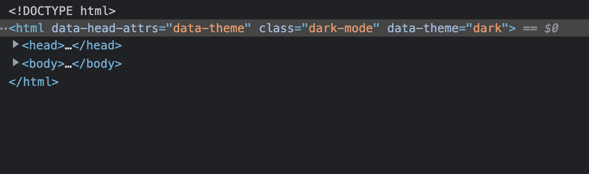
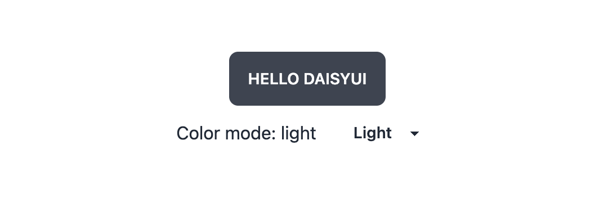

sFirst, start a new nuxt app, a terminal, run..

From https://v3.nuxtjs.org/getting-started/quick-start

```
npx nuxi init nuxt-app
```

Next, Nuxt Color Mode

https://color-mode.nuxtjs.org/

```
yarn add --dev @nuxtjs/color-mode

```

Then configuration as follows:

```javascript
import { defineNuxtConfig } from 'nuxt'

export default defineNuxtConfig({
  modules: ['@nuxtjs/color-mode']
})

```
Usage example.

```javascript
<template>
  <div>
    <h1>Color mode: {{ $colorMode.value }}</h1>
    <select v-model="$colorMode.preference">
      <option value="system">System</option>
      <option value="light">Light</option>
      <option value="dark">Dark</option>
      <option value="sepia">Sepia</option>
    </select>
  </div>
</template>

<script setup>
  const colorMode = useColorMode()
  console.log(colorMode.preference)
</script>

<style>
body {
  background-color: #fff;
  color: rgba(0,0,0,0.8);
}
.dark-mode body {
  background-color: #091a28;
  color: #ebf4f1;
}
.sepia-mode body {
  background-color: #f1e7d0;
  color: #433422;
}
</style>
```

Now on to tailwind...

```
yarn add  -D tailwindcss postcss@latest autoprefixer@latest @nuxt/postcss8
npx tailwindcss init

```
As this is a `from scratch` new build... I'm curious so the see how the configuration comes together and noting the procedures during the initial stages where I load it all up. The reason I'm thinking that is during my last nuxt 3 build, I had problems with the tw docs and the `postcss8` as well as some other configuration differences in the `nuxt.config.ts` file. I'll make notes along the way.

Next, a checkup on the above with a tailwind screen and a color mode swap, then on to daisy for the themes.

First, in app.vue, I'll throw some tailwind markup in...

```javascript
<template>
  <div>
    <div class="h-screen bg-pink-700 text-white">yo</div>
  </div>
</template>
```

This is the current config... 

```javascript // nuxt.config.ts
import { defineNuxtConfig } from "nuxt";

export default defineNuxtConfig({
  css: ["@/assets/css/tailwind.css"],
  modules: ["@nuxtjs/color-mode"],
});

```

Next adding the postcss8...

```javascript
export default defineNuxtConfig({
  css: ["@/assets/css/tailwind.css"],
  modules: ["@nuxtjs/color-mode", "@nuxt/postcss8"],
});

```

```
 ERROR  Cannot restart nuxt:  postcss@8 is not compatible with current version of nuxt (0.0.0). Expected: >=2.15.3
 ```
Next, backing out tailwind docs version of postcss8...

```
 yarn remove @nuxt/postcss8
 ```

 Went with the non-nuxt and latest version... 

 ```
 yarn add postcss@latest
 ```
 After adding this, for the postcss setup...

 ```javascript
  build: {
    postcss: {
      postcssOptions: require("./postcss.config.js"),
    },
  },
  ```
I'm still getting an error and a notice about no utility classes... so tailwind has not run, and there's another error about importing directly in the nuxt config... 

This is the problem:

<span class="bg-red-400">**ERROR**</span>  Importing directly from a nuxt.config file is not allowed. Instead, use runtime config or a module. [importing /nuxt.config.ts from index.html] 

removed this line from the tailwind docs config settings..

```
 "./nuxt.config.{js,ts}",
```
Problem gone, but still no buena... until, added ` "./app.vue", ` to the tailwind.config.js and it all snapped in line!

Final tailwind.config.js below:

```javascript
/** @type {import('tailwindcss').Config} */
module.exports = {
  content: [
    "./components/**/*.{vue,js}",
    "./layouts/**/*.vue",
    "./pages/**/*.vue",
    "./plugins/**/*.{js,ts}",
    "./app.vue",
  ],
  theme: {
    extend: {},
  },
  plugins: [],
};

```
Cool! So, tailwind is good, no other console errors, checking the nuxt color mode now before moving on to the daisy, then gsap setup!

So back on over to [@nuxtjs/color-mode](https://color-mode.nuxtjs.org/)

Remember from the last build, the trick will be to match this module up with the requirements for daisyUI, which are `data-theme='dark'` rather than just a class on the html root whereas tailwind and the colorMode module are also reading the class, it's also storing values in local storage so my configuration for this is deep and works well, it's just a bit of configuration at the start that's needed... this should be quick, and here's the winning setup below...

The screenshots below show the go-to method for debugging dark mode or theming issues for me, the dev tools. 


As you can see, the color mode module seems to be already working as expeced from the `@nuxtjs/color-mode` installation done a few steps back, now it's just a matter of making the adjustment to how it implements it, and syncing it all together between tailwind, @nuxtjs/dark-mode, and the next item coming.. daisyUI.

To do that, adjusting the colorMode module options to use the dataValue `theme` which will then attach the `data-theme="cupcake"` on the root html element. 

```javascript
// added this in nuxt.config.ts
  colorMode: {
    dataValue: "theme",
  },

```

Now the head shows a working setup, ready for theming!



And this is the current `nuxt.config.ts`

```javascript
import { defineNuxtConfig } from "nuxt";
import colorModeModule from "@nuxtjs/color-mode";

export default defineNuxtConfig({
  css: ["@/assets/css/tailwind.css"],
  modules: [colorModeModule],
  colorMode: {
    dataValue: "theme",
  },
  build: {
    postcss: {
      postcssOptions: require("./postcss.config.js"),
    },
  },
});

```

Now it's on to daisyUI, with the 29 presets daisyUI ships with and the ability to create your own with just a few variables, I still haven't had to touch a single line of CSS and will soon have a fully theme ready configuration for nuxt, using tailwing and daisy and will then put the icing on the cake with animations!

daisyUI Setup now btw, it's easy... *really easy!*

From the docs... https://daisyui.com/docs/install/

```
yarn add daisyui 
```
then add as a tailwind plugin...

```javascript
module.exports = {
  //...
  plugins: [require("daisyui")],
}
```
Re-run the app and it's clear daisy is working, all of this from just this `class='btn'`


Now, before moving on, let's link up with the colorMode module installed early on, back to this site for the documentation and sample code to set themes....

Here's the example.

```javascript

<template>
  <div>
    <h1>Color mode: {{ $colorMode.value }}</h1>
    <select v-model="$colorMode.preference">
      <option value="system">System</option>
      <option value="light">Light</option>
      <option value="dark">Dark</option>
      <option value="sepia">Sepia</option>
    </select>
  </div>
</template>

<script setup>
  const colorMode = useColorMode()
  console.log(colorMode.preference)
</script>

<style>
body {
  background-color: #fff;
  color: rgba(0,0,0,0.8);
}
.dark-mode body {
  background-color: #091a28;
  color: #ebf4f1;
}
.sepia-mode body {
  background-color: #f1e7d0;
  color: #433422;
}
</style>

```

Now, I already know I am dropping the css and all of the list modes they have here, so this is the new component I'm creating, first for the `components` directly, and comes with amazing features and caveats under Nuxt...

```javascript

// @/components/ThemeChangeButton.vue
<template>
  <div>
    <h1>Color mode: {{ $colorMode.value }}</h1>
    <select v-model="$colorMode.preference">
      <option value="light">Light</option>
      <option value="dark">Dark</option>
    </select>
  </div>
</template>

<scrip setup>
  const colorMode = useColorMode()
  console.log(colorMode.preference)
</script>

```

Then dropping this into the app.vue file and wrapping them with a div to center them as follows:

```javascript
// app.vue
<template>
  <div>
    <div class="h-screen grid place-items-center justify-center text-center">
      <div>
        <button class="btn">Hello daisyUI</button>
        <ColorModeSelect />
      </div>
    </div>
  </div>
</template>

```

That gives just this...




I'll get gsap setup, then it's a complete starter and ready for branding and customization, I'll drop a little animation in then publish this repo and come back to it for the next nuxt project for a headstart.

## Why GSAP?

In a word... simplicity. I understand Framer Motion is great, I've used it... I also know there's a vue version heavily inspired by it, but with GSAP, it just works with **all frameworks** and *even better, it works the same*. I can write animations and timelines than can easily port in and out of projects in Vue, React, Svelte, Next, Nuxt, Gatsby, Gridsome, etc... even Vanilla JS! and it's the same... it doesn't require any further argument in my book. That's why it's GSAP for me... 

If you don't like it or need it for your starter, simply skip this step! Move on directly to the final piece which is nuxt/content... also, not necessary, but if you wait and see what it brings to the table, woww.. and you'll likely never go back! 

For now, a quick GSAP install and setup...

```
yarn add gsap

```
You do not need to modify the `nuxt.config.ts` to have this running. It's installed as a dependency and you can import it and use it wherever you want. 

You can verify gsap is up and running with a few lines of code and a basic animation, here's the approach I found that worked with nuxt 3 and vue 3 as well... 

I got undefined references during render, etc errors when trying it with the composition api and script setup, the following works well in both app.vue and in any other component...

```javascript

import gsap from 'gsap'

export default {
  mounted() {
    this.sayHello()
  },

  methods: {
    sayHello() {
      gsap.to(".hello", { y: -30, duration: 2, ease: 'ease-out' });
    }
  }
}


```

I have imported it as a component in app.vue which is using `script setup` and it works perfectly as well. I have seen a few approaches to using it other ways but the above using the mounted life cycle hook works. I have more to learn in version 3 of both vue and nuxt so if you are aware of another method, please share in the comments!

As for GSAP Plugins and other features, this is configured via the nuxt config file, and below is an example that I created that works quite nicely and can be used as a starting point for bringing in additional features...

```javascript

  gsap: {
    extraPlugins: {
      scrollTo: true,
      scrollTrigger: true,
    },
    extraEases: {
      expoScaleEase: true,
    },
  },
  ```

I created a `@/components/HelloDaisy.vue` component that picks up on the above `extraEases` option. I now use it to drop in as a quick test out of the box for daisyUI and GSAP setup...

> HelloDaisy.vue
```javascript

<template>
    <div class="hello text-4xl font-extrabold text-accent">Hello Daisy and GSAP 🎉</div>
</template>

<script>
import gsap from 'gsap'

export default {
    mounted() {
        this.sayHello()
    },

    methods: {
        sayHello() {
            gsap.to(".hello", { rotation: -23, y: -200, duration: 2 });
            gsap.to(".hello", { opacity: 0, duration: 2, scale: 3, ease: "expoScale(1, 3)" });
        }
    }
}
</script>

```

Dropping that file into the project confirms both the added features to the nuxt 3 starter are good to go! Doing a little clean up on the starter, and wanting to make sure and polish off for a new starter repo, I am going to do some clean up...

Cleaning up the main app.vue file, this will be a great starter set, one app.vue file, two components.. one as a quick test for tailwind/daisyUI/gsap `HelloDaisy.vue` and one `ColorModeSelect.vue` and since this project will be a simple starter with light/dark only but definitely theme ready for more... I'm going to modify the select into a nice switch and use some icons for light and dark mode and then branch for the version that will also have `@nuxt/content`

```javascript
<template>
  <div>
    <div class="h-screen grid place-items-center justify-center text-center">
      <div>
        <HelloDaisy />
        <ColorModeSelect />
      </div>
    </div>
  </div>
</template>
```

## Setting Up the Color Mode Switch in Nuxt 3

Using `@nuxt/color-mode` and `daisyui` makes it easy to create the ideal light/dark mode switch.

I'm going to use daisyUI's `swap` component for a nice transition and modify the example into a working light switch with a few tweaks to the above `@nuxtjs/color-mode` example and the daisyUI `swap` example below...

```html
<label class="swap swap-rotate">
  
  <!-- this hidden checkbox controls the state -->
  <input type="checkbox" />
  
  <!-- sun icon -->
  <svg class="swap-on fill-current w-10 h-10" xmlns="http://www.w3.org/2000/svg" viewBox="0 0 24 24"><path d="M5.64,17l-.71.71a1,1,0,0,0,0,1.41,1,1,0,0,0,1.41,0l.71-.71A1,1,0,0,0,5.64,17ZM5,12a1,1,0,0,0-1-1H3a1,1,0,0,0,0,2H4A1,1,0,0,0,5,12Zm7-7a1,1,0,0,0,1-1V3a1,1,0,0,0-2,0V4A1,1,0,0,0,12,5ZM5.64,7.05a1,1,0,0,0,.7.29,1,1,0,0,0,.71-.29,1,1,0,0,0,0-1.41l-.71-.71A1,1,0,0,0,4.93,6.34Zm12,.29a1,1,0,0,0,.7-.29l.71-.71a1,1,0,1,0-1.41-1.41L17,5.64a1,1,0,0,0,0,1.41A1,1,0,0,0,17.66,7.34ZM21,11H20a1,1,0,0,0,0,2h1a1,1,0,0,0,0-2Zm-9,8a1,1,0,0,0-1,1v1a1,1,0,0,0,2,0V20A1,1,0,0,0,12,19ZM18.36,17A1,1,0,0,0,17,18.36l.71.71a1,1,0,0,0,1.41,0,1,1,0,0,0,0-1.41ZM12,6.5A5.5,5.5,0,1,0,17.5,12,5.51,5.51,0,0,0,12,6.5Zm0,9A3.5,3.5,0,1,1,15.5,12,3.5,3.5,0,0,1,12,15.5Z"/></svg>
  
  <!-- moon icon -->
  <svg class="swap-off fill-current w-10 h-10" xmlns="http://www.w3.org/2000/svg" viewBox="0 0 24 24"><path d="M21.64,13a1,1,0,0,0-1.05-.14,8.05,8.05,0,0,1-3.37.73A8.15,8.15,0,0,1,9.08,5.49a8.59,8.59,0,0,1,.25-2A1,1,0,0,0,8,2.36,10.14,10.14,0,1,0,22,14.05,1,1,0,0,0,21.64,13Zm-9.5,6.69A8.14,8.14,0,0,1,7.08,5.22v.27A10.15,10.15,0,0,0,17.22,15.63a9.79,9.79,0,0,0,2.1-.22A8.11,8.11,0,0,1,12.14,19.73Z"/></svg>
  
</label>
```

The swap works great and after dropping it into the `ColorModeSelect.vue` component I begin to diagnose the situation for options...

```html
   <!-- this hidden checkbox controls the state -->
   <input type="checkbox" v-model="$colorMode.preference" />
```

Simply attaching the `$colorMode.preference` provided by the script setup won't work as it's not a boolean we need... we need `$colorMode.preference` to be the theme name, light/dark/daisy etc... We have a couple of options:

1. Use a method to establish the boolean and keep the working swap component from daisyUI or modify it to use a select or radio to keep the value of the theme, not a boolean... problem is, swap is an on/off with it's own presets and configuration and markup rules, so... decision time.

2. The color mode swap is using the `script setup` and I'd like to keep it that way and not create additional methods. After tinkering with a few ideas, this is the settled upon solution that works, keeps the state, keeps the swap animation we got for free and syncs with the `useColorMode()` for a working global state solution and simple implementation... 

3. While trying to use the swap as-is from daisyUI and the colorMode instance, it became apparent I was attempting to 'rig' something just for the sake of using the out of box transition animation, the problem was I could not keep that item in sync with the model and decide to create a custom piece that I could not only fully control and animate but also introduce a system as well as additional options other than just light/dark as daisyUI is fully customizable and I did like that when putting the site at 'system', it would automatically detect and adjust to my preferences in real time... 

4. I like the idea of keeping `system` as an option that clears localStorage of a preference and responds to the users preference by default.

Here's the custom component with a directory nested within a module I can begin to manually import into other projects and further customize.

```javascript 
// ColorModePicker.vue
<template>
  <ul class="flex w-12 flex-col items-center justify-center bg-primary rounded-full fixed top-0 right-0">
    <li v-for="color of colors" :key="color" class="icon-colormode">
      <component :is="`icon-${color}`" class="flex w-12 h-12 p-4 cursor-pointer text-primary-content"
        :class="getClasses(color)" @click="$colorMode.preference = color" />
    </li>
  </ul>
</template>

<script>
import IconSystem from '@/components/colormode/icons/system.svg.vue'
import IconLight from '@/components/colormode/icons/light.svg.vue'
import IconDark from '@/components/colormode/icons/dark.svg.vue'
import IconCoffee from '~~/components/colormode/icons/coffee.svg.vue'

export default {
  components: {
    IconSystem,
    IconLight,
    IconDark,
    IconCoffee,
  },

  data() {
    return {
      colors: ['system', 'light', 'dark', 'coffee'],
    }
  },

  methods: {
    getClasses(color) {
      // Does not set classes on ssr preference is system (because we know them on client-side)
      if (this.$colorMode.unknown) {
        return {}
      }
      return {
        preferred: color === this.$colorMode.preference,
        selected: color === this.$colorMode.value,
      }
    },
  },
}
</script>

```

As a side endeavor and for educational practices I aim to re-write this component with the composition api into something resembling the version that simply set the `$colorMode.preference` as the model on a select input and allowed for one line in the script setup, as below...

```javascript
<script setup>
const colorMode = useColorMode()
</script>
```
For now... moving on! But as a quick note the above configuration allowed me to setup the theme/colormode picker as a column and I plan on having it to the right of the site or as a drop menu on a settings icon, for now the setup is like this...

> Returning to this segment... upon implementing animations with the setup vs options to use the composition api, I discoverd a technique to accomplish this and will now refactor this into an animated component

New component, `ColorModeSettings.vue`

This is the version to be used on the client, have some animations and controls, and be easily configured as a standalone component to handle the settings for the entire site. I have so far been leveraging `nuxt/color-modes` and in other projects, similar packages that handle the entire piece from class/data settings on the client to localStorage and user `media prefers > color-scheme-dark` etc... but with the full capabilities of theming implemented, then user related features can be added...

Aside from just the current colorMode (theme) there can now be added additional settings to be 'housed' together in a settings icon/menu/drawer. And being of similar nature and usage, all be orchestrated from one component, soon to be `SiteSettings.vue`. Then this can grow and/intermingle or help replicate other such panels like:
  - Shopping carts
  - User preferences, layouts, etc.
  - Messages, notifications, chat...
  - User related to the particular project, *and so on....*
 
### Note on icons... 

Icons can easily be linked to a library, imported for use inline via some type of module, etc.. I like this method I'm using now in my theme builds. Bring the icons in as svg BUT create components out of them that can then be enhanced... additionally, with vue's reactivity and nuxt's supercharged components directory features, the SVG can then be really brought to life... and a lot more than just passing a `currentColor`!

Below is the `@/components/colormode/icons/system.svg.vue` and notice how I included the original file extension even though I have already wrapped on in a div... keep in mind, these svgs, being located in Nuxt's components folder have access to *everything...* so applying more interactivity will be possible, and fun.

```javascript

<template>
    <!-- this div wrapper keeps the svg from being clipped -->
    <div>
        <svg xmlns="http://www.w3.org/2000/svg" width="24" height="24" viewBox="0 0 24 24" fill="none"
            stroke="currentColor" stroke-width="2" stroke-linecap="round" stroke-linejoin="round"
            class="feather feather-monitor">
            <rect x="2" y="3" width="20" height="14" rx="2" ry="2"></rect>
            <line x1="8" y1="21" x2="16" y2="21"></line>
            <line x1="12" y1="17" x2="12" y2="21"></line>
        </svg>
    </div>
</template>

```

Now, with a fancy spinner welcome, we have the completed starter... The ui, the styling, the theming, and the animations are all fully loaded and ready to go with

- TailwindCSS 
- daisyUI
- GSAP 
- Nuxt Color Mode
- Nuxt Content

And soon I look to add:

- State Management with Pinia
- Firebase Integration
  - Auth
  - Firestore
  - Functions
  - Hosting

There will be many projects that this will be an ideal seed for! And regardless of whether they be heavy or light on the  `content` such as the text, labels, titles, etc... the next evolution of this project will be the implementation of a content system where the written content (variable) can be separated from as much markup as possible... the easy of maintaining and adding content when using markdown or outsite sources (headless cms) will be extremely useful... especially since this is a starter project! So... enter `@nuxt/content`

### The Nuxt content option...

Optional but amazing in my opinion, the `@nuxt/content` module... this brings many content features and the ability to use `.md` and `.mdx` files and fully ***supercharge*** the content of the website! 

I struggled to get this configuration to work and spent a few hours and was extremely close to scrapping it entire until the wrestling match was one and I emerged as the victor. It's an amazing new must have I am just now beginning to appreciate and implement and finding new uses for it quickly!

https://content.nuxtjs.org/


## This project now a forked version of nuxt deluxe

Just starting this as the Voya Destinations project, immediate next steps include:
- Pinia Integration
- Vue composition api state Management implementation
- Counters, Todos, etc... built in `admin/settings` for sites... can then be persisted, remote config? etc...
- Animations for Elements... the navbar, the color modes, floating menus, etc...

For now... firebase? or more theme setting stuff? or... content... or hero builders... all integrated for use together and maximum reusability as standalone project in dev tandem


## A Nuxt Deluxe project


Now, with a fancy spinner welcome, we have the completed starter... The ui, the styling, the theming, and the animations are all fully loaded and ready to go with

- TailwindCSS 
- daisyUI
- GSAP 
- Nuxt Color Mode
- Soon to be added...
  - @nuxt/content
  - firebase
  - @tailwindcss/templates/themes/storybook etc... 

This project to showcase a variety of projects...

-   StripeSafePay (Stripe)
-   PhoenixFire (Firebase)
-   Butterfly (Flutter)
-   DaisiesInTheWind (Next Blog)
-   TailwindCSS Themes (Artasce)
-   TailwindCSS Templates (Artasce)
-   PinaColada (Pinia)


# Now with Nuxt Content...

```javascript
<template>
    <main>
        <ContentDoc class="prose" />
    </main>
</template>

```


Next, sidebars, filler stuff such as copyright, etc... all in portable amazing content directories! Time to start creatin come...
```javascript
<template>
  <nav>
    <ContentNavigation v-slot="{ navigation }">
      <div v-for="link of navigation" :key="link._path">
        <NuxtLink :to="link._path">{{ link.title }}</NuxtLink>
      </div>
    </ContentNavigation>
  </nav>
</template>

```


# Project Update/Summary 

A quick update, the project asset gathering has begun, there's a wp elementor setup to create landing pages and brochure pages to describe the app.

- Android/iOS app
- website
- landing pages
- social marketing assets library
- dev blog / doc site

Currently active as well...

- Firebase as a Backend
- Headless WP landing page generator
- Nuxt Site with Admin/Firebase

