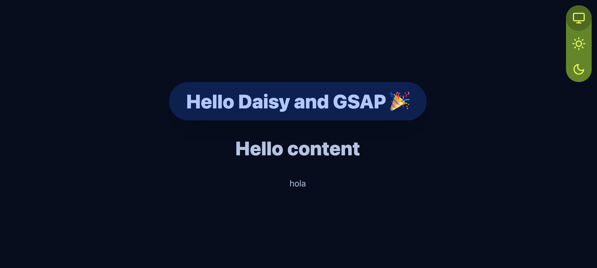

# Voya Destinations... 

Started from a snazzy starter in parallel as it grows. Setting up a 'workspace' or examples master repo would be nice... yarn workspaces are perhaps a little tricky, but it could be ideal. I will figure it out as we build, same reason for forking this and moving forward on the Voya Destinations project.

## A Nuxt Deluxe project

Now, with a fancy spinner welcome, we have the completed starter... The ui, the styling, the theming, and the animations are all fully loaded and ready to go with

- TailwindCSS 
- daisyUI
- GSAP 
- Nuxt Color Mode
- Soon to be added...
  - @nuxt/content
  - firebase
  - @tailwindcss/templates/themes/storybook etc... 

This project to showcase a variety of projects...

-   StripeSafePay (Stripe)
-   PhoenixFire (Firebase)
-   Butterfly (Flutter)
-   DaisiesInTheWind (Next Blog)
-   TailwindCSS Themes (Artasce)
-   TailwindCSS Templates (Artasce)
-   PinaColada (Pinia)

# Now with Nuxt Content...

